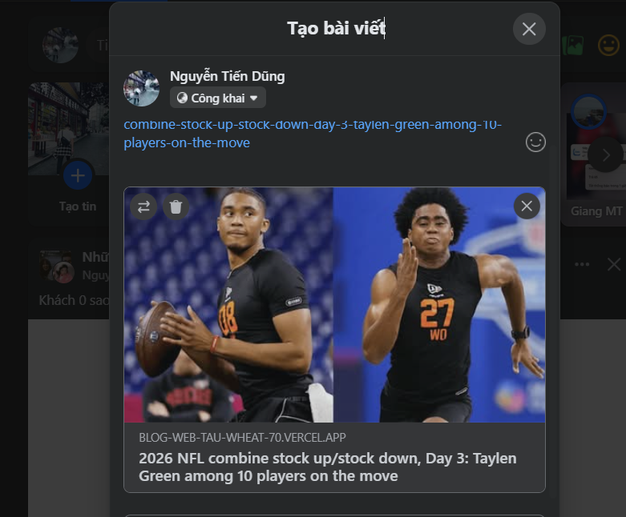
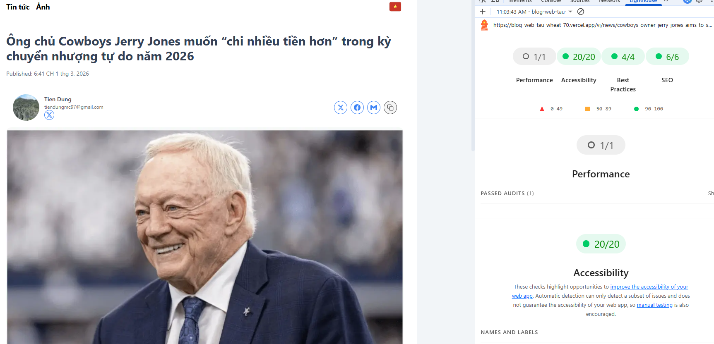
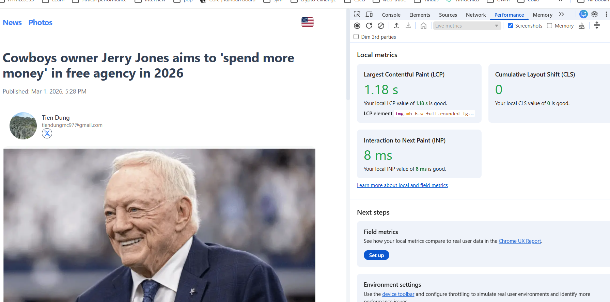
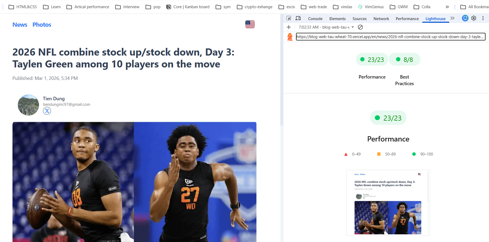

# 📌 BLOG SYSTEM DEMO (Web + Admin)

Tập trung vào việc thiết lập cấu trúc code rõ ràng, dễ mở rộng và demo các chức năng chính của hệ thống.

## 1. Thông tin dự án

### 🔹 Web (Frontend – Next.js)

- URL: https://blog-web-tau-wheat-70.vercel.app
- Repository: https://github.com/tiendungmc97/blog-web

### 🔹 Admin (Strapi CMS)

- URL: https://eloquent-canvas-7ae6696625.strapiapp.com/admin
- Tài khoản demo:
  - Email: tiendungmc97@gmail.com
  - Password: 123@123Aa

---

# 2. Tổng quan hệ thống

Hệ thống bao gồm 2 phần chính:

- **Admin (Strapi CMS):** Quản lý nội dung
- **Web (Next.js):** Hiển thị nội dung và tối ưu SEO, hiệu năng

Mô hình triển khai theo kiến trúc **Headless CMS**.

---

# 3. Admin – Quản lý nội dung với Strapi

CMS được xây dựng bằng **Strapi**.

## 3.1 Content Types

- News
- PhotoArticle

## 3.2 Tính năng chính

- Tạo / chỉnh sửa / xoá bài viết
- Hỗ trợ đa ngôn ngữ (i18n)
- Quản lý trạng thái bài viết:
  - Draft
  - Published
- Quản lý hình ảnh cho từng bài viết
- API public cho frontend sử dụng

---

# 4. Web – Frontend (Next.js)

Frontend được xây dựng bằng **Next.js**, tập trung vào:

- SEO
- Hỗ trợ nhiều ngôn ngữ.

---

## 4.1 Hỗ trợ đa ngôn ngữ (i18n)

- Hỗ trợ nhiều ngôn ngữ.
- Nếu không truyền `language`:
  - Tự động detect theo ngôn ngữ của trình duyệt.
  - Fallback về ngôn ngữ mặc định nếu không hợp lệ.

---

## 4.2 Tối ưu SEO

Áp dụng nhiều chiến lược render:

- **SSR (Server-Side Rendering)**
- **SSG (Static Site Generation)**
- **ISR (Incremental Static Regeneration)**

Mục tiêu:

- Tối ưu khả năng crawl của Google
- Tăng tốc độ tải trang
- Cải thiện Core Web Vitals
- Hạn chế hydration mismatch

---

## 4.3 generate Metadata, open Graph & Social Preview

- Hiển thị đúng preview khi share Facebook
- Hiển thị Twitter Card
- Có thể kiểm tra metadata bằng DevTools
  

---

# 5. Performance & Best Practices

Dự án được kiểm tra bằng Google Lighthouse.

Thực hiện:

- Lighthouse Snapshot
- Lighthouse Timespan

Đánh giá các tiêu chí:

- Accessibility
- SEO
  

- Performance
  

- Best Practices
  
